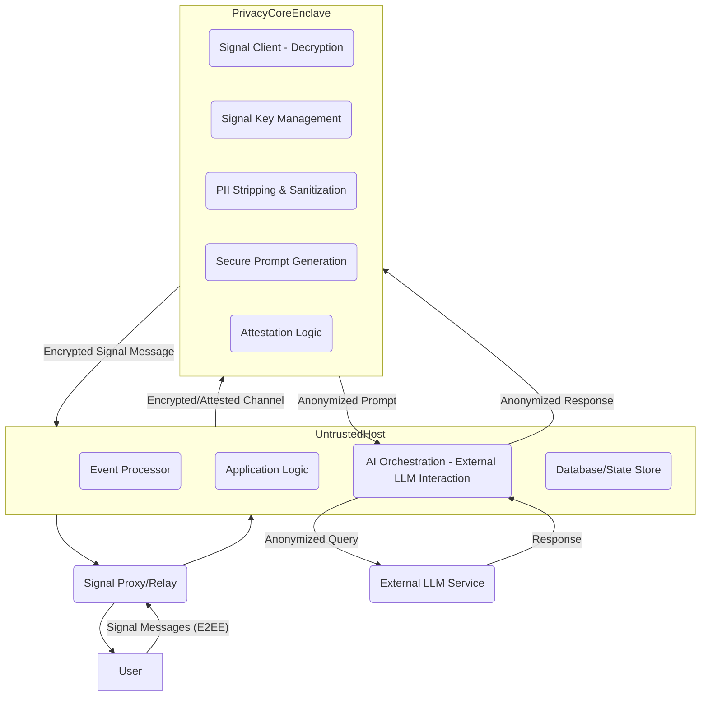

### **1) Threat Model and Goals**

**1.1. Adversaries**

*   **External Attacker (Internet):** Any unauthorized entity attempting to compromise the service from the public internet (e.g., malware, DDoS, remote exploits).
*   **Malicious/Compelled Operator (Internal):** An employee or insider attempting to access or leak sensitive data, or an operator compelled by a legal process (e.g., search warrant, subpoena) to provide plaintext data.
*   **Compromised Host OS/Hypervisor:** The underlying operating system or virtualization layer of the cloud provider is compromised, allowing the adversary to control the host server (outside the TEE).
*   **Government with Subpoena + Gag Order:** A state actor with legal authority compelling the service operator to provide data and preventing disclosure of this compulsion.
*   **TEE Hardware/Microcode Vulnerability:** A fundamental flaw in the TEE hardware or its accompanying microcode/firmware that undermines its security guarantees.
*   **Compromised LLM Provider:** The external Large Language Model (LLM) service provider is compromised, leading to exposure of data sent to them.

**1.2. What We Are Trying to Achieve**

Our primary goal is to provide a commercial, AI-powered Signal assistant with a highly resilient privacy posture. Specifically, we aim to achieve:

*   **Minimized Retrospective Exposure (Data at Rest):** Limit the amount of user conversation history that exists in a plaintext, readable form at any time, anywhere in our system. Raw message content should be ephemeral within the TEE.
*   **Minimized Identity Binding:** Decouple Signal IDs/phone numbers from internal identifiers as much as technically feasible and as early as possible in the data processing pipeline. User data stored long-term should be pseudonymous.
*   **Visible Wiretapping (Future Plaintext Access):** Make it technically impossible to enable future plaintext wiretapping or logging of user messages *without a cryptographically verifiable change to the attested code within the TEE*. This means any such compelled change would invalidate remote attestation, making the act visible to the user.
*   **Protection Against Compelled Operators:** Prevent even a malicious or compelled operator (including the bot developers) from technically accessing plaintext user messages or the bot's Signal private key.
*   **Integrity of Core Logic:** Ensure that the critical privacy-preserving logic (message decryption, PII stripping, key management) cannot be tampered with by a compromised host or external attacker.

**1.3. What We Explicitly Cannot Achieve Given Constraints**

*   **Direct User Control:** We operate the servers and control deployments; users do not directly control the execution environment.
*   **Client-Side Attestation for Signal App:** The client is the stock Signal app, which offers no custom client-side logic for attestation or integration with our TEE. User verification relies on remote attestation via an external mechanism.
*   **Full Trustlessness:** We are not achieving full trustlessness. Users must still:
    *   Trust the TEE hardware vendor.
    *   Trust that our publicly published hashes for the attested code are accurate.
    *   Trust the external LLM provider to handle anonymized prompts securely (if LLM is external to TEE).
    *   Trust that our closed-source application logic acts benignly on the anonymized data provided by the Privacy Core (mitigated by TEE interface design and open-sourcing the Privacy Core).

**1.4. Guiding Principle: Minimized Trust and Bounded Damage**

This architecture is founded on the principle of **minimized trust and bounded damage**. We aim to reduce the scope of trust required in any single component or party (including ourselves) and to ensure that even if components outside the TEE are compromised, or if legal pressure is applied, the exposure of plaintext user data is either technically impossible or immediately detectable by the user.

---

### **2) High-Level Architecture**

The AI-powered Signal Assistant employs a layered architecture, with critical privacy-sensitive operations confined within one or more Trusted Execution Environments (TEEs) to establish strong trust boundaries.

**2.1. Main Components and Their Trust Boundaries**

*   **Untrusted Host Environment (OS/Hypervisor):** This is the underlying cloud infrastructure (VM, OS, hypervisor) where the bot is deployed. It is considered *untrusted* for sensitive operations. Any component running outside the TEE within this environment is subject to compromise by a powerful adversary (e.g., cloud provider insider, sophisticated external attacker). This environment hosts the Event Processor, a portion of the AI Orchestration Layer, Application Logic, and Persistence.
*   **Trusted Execution Environment (TEE) / Enclave(s):** This is the hardware-protected secure enclave (e.g., Intel SGX, AWS Nitro Enclaves) where core privacy and security logic resides. The code and data *inside* the TEE are protected from inspection and tampering by the host OS, hypervisor, and even the developer. The TEE provides cryptographic attestation to verify the integrity of the code running within it.
    *   **Privacy Core Enclave:** A dedicated TEE instance housing the Signal Client Layer (decryption), Signal private key, PII stripping logic, and secure prompt generation. This enclave is the primary protector of plaintext user data.
    *   **(Optional/Future) LLM Enclave:** Potentially a separate TEE instance or an extension of the Privacy Core, specifically for running smaller LLMs or performing highly sensitive LLM inference locally, avoiding external LLM provider exposure.

*   **External LLM Service:** A third-party cloud-based Large Language Model provider (e.g., Google Gemini, OpenAI). This is considered a *partially trusted* boundary; we trust it to process anonymized data but not to handle PII.

**2.2. Auxiliary Services (Running outside TEE, considered Untrusted):**

*   **Signal Proxy/Relay:** Handles raw Signal traffic; responsible for forwarding encrypted messages to the Event Processor and sending encrypted messages from the bot back to Signal.
*   **Logging/Monitoring Infrastructure:** Collects operational logs (metadata only) and metrics.
*   **CI/CD Pipeline:** Manages deployment of code to the untrusted host and provisioning of TEEs.
*   **Remote Attestation Service:** While the attestation *logic* is in the TEE, the service that receives attestation requests and makes them available (e.g., a simple web endpoint) runs outside the TEE.

---

### **3) Detailed TEE-based Design**

The core of our privacy guarantees rests on the **Privacy Core Enclave**.

**3.1. Privacy Core Enclave Responsibilities (within TEE)**

The Privacy Core Enclave is a single, attested component responsible for:

*   **Signal Private Key Custody:** Generating, storing, and managing the bot's Signal private key. This key is cryptographically sealed within the TEE and never exposed to the host OS or developer.
*   **Message Decryption:** Receiving encrypted Signal messages from the untrusted host, decrypting them *only inside the TEE*.
*   **User Identity Mapping (Pseudonymization):** Mapping Signal IDs/phone numbers to internal, randomly generated, ephemeral or pseudonymous user identifiers *within the TEE*. This mapping should not persist longer than necessary for active conversation context.
*   **PII Stripping & Sanitization:** Performing rigorous Personally Identifiable Information (PII) stripping and sanitization on the plaintext message content immediately after decryption.
*   **Secure Prompt Generation:** Constructing anonymized prompts for external LLMs based on the de-identified message content and relevant context (also de-identified).
*   **Response Validation/Sanitization:** Receiving responses from external LLMs, potentially validating and sanitizing them for PII or malicious content *before* passing them to the closed-source Application Logic or encrypting them for the user.
*   **Message Encryption:** Encrypting outgoing bot responses using the Signal private key *within the TEE*.
*   **Attestation Logic:** Containing the code necessary to generate attestation reports, including its code measurement, for remote verification.
*   **Ephemeral State Management:** Managing short-term, in-memory conversational context that is vital for prompt generation but *must not persist* outside the TEE in plaintext form.

**3.2. Interface between Privacy Core Enclave and Untrusted Host**

This interface is critical and must be strictly defined and enforced:

*   **Incoming (Host to TEE):** The untrusted host sends encrypted Signal messages to the TEE. This channel should be authenticated and integrity-protected (e.g., TLS with mutual authentication, where the TEE presents an attestation-bound certificate).
*   **Outgoing (TEE to Host):**
    *   **Anonymized Prompts:** The TEE outputs anonymized, de-identified prompts (and potentially anonymized user identifiers) to the untrusted host for interaction with external LLMs. These prompts *must not* contain any PII or information that could be used to re-identify the user.
    *   **Encrypted Bot Responses:** The TEE outputs encrypted Signal messages (bot responses) to be sent back to the user.
    *   **Attestation Reports:** Cryptographically signed attestation reports (containing code measurement) are output to the untrusted host for user verification.
    *   **Minimal Metadata:** Highly anonymized operational metadata (e.g., message processed count, error codes, performance metrics) that *cannot be linked to specific users or content* may be emitted for observability.
*   **Interface Contract:** The API contract between the Privacy Core Enclave and the untrusted host should be minimal, well-documented, and cryptographically enforced to ensure only permitted data flows occur.

**3.3. Hybrid Open-Source Model**

*   To maximize trust in the critical privacy path, the **Privacy Core Enclave's code will be open-sourced**. This allows public scrutiny of the decryption, PII stripping, and key management logic.
*   The attested hash provided via remote attestation will correspond to this publicly auditable codebase.
*   The remaining components (Event Processor, much of AI Orchestration, Application Logic, Persistence) run outside the TEE and remain closed-source.

---

### **4) Data Flows**

**4.1. Incoming User Message Flow**

1.  **User to Signal Network:** User sends an encrypted message via the stock Signal client.
2.  **Signal Network to Signal Proxy:** Signal network delivers the encrypted message to our Signal Proxy/Relay.
3.  **Signal Proxy to Event Processor (Untrusted Host):** The Signal Proxy forwards the encrypted message to the Event Processor running on the untrusted host.
4.  **Event Processor to Privacy Core Enclave (TEE):** The Event Processor, after initial filtering (e.g., duplicate message detection), sends the *encrypted Signal message* to the Privacy Core Enclave via an authenticated and integrity-protected channel.
5.  **Privacy Core Enclave (TEE) - Decryption & PII Stripping:**
    *   The encrypted message is decrypted *inside the TEE*.
    *   The plaintext message undergoes immediate PII stripping and pseudonymization.
    *   The user's Signal ID is mapped to an internal, ephemeral/pseudonymous identifier *within the TEE*.
6.  **Privacy Core Enclave (TEE) - Prompt Generation:** The de-identified message content and any relevant, de-identified conversational context (managed ephemerally within the TEE) are used to construct an anonymized prompt for the LLM.
7.  **Privacy Core Enclave (TEE) to AI Orchestration (Untrusted Host):** The **anonymized prompt** is sent from the TEE to the AI Orchestration layer on the untrusted host. This output *must not* contain any PII or information that could be used to re-identify the user.
8.  **AI Orchestration (Untrusted Host) to External LLM:** The AI Orchestration layer forwards the anonymized prompt to the external LLM service.

**4.2. Outgoing Bot Response Flow**

1.  **External LLM to AI Orchestration (Untrusted Host):** The external LLM service sends its response (based on the anonymized prompt) back to the AI Orchestration layer.
2.  **AI Orchestration (Untrusted Host) to Privacy Core Enclave (TEE):** The AI Orchestration layer sends the LLM response (still anonymized) back to the Privacy Core Enclave.
3.  **Privacy Core Enclave (TEE) - Response Processing & Encryption:**
    *   The LLM response is potentially validated/sanitized *inside the TEE*.
    *   The bot's response is prepared.
    *   The response is encrypted using the Signal private key *inside the TEE*, targeting the original user's Signal ID (mapped via the ephemeral/pseudonymous identifier).
4.  **Privacy Core Enclave (TEE) to Event Processor (Untrusted Host):** The **encrypted Signal message (bot response)** is sent from the TEE to the Event Processor on the untrusted host.
5.  **Event Processor (Untrusted Host) to Signal Proxy:** The Event Processor forwards the encrypted bot response to the Signal Proxy.
6.  **Signal Proxy to Signal Network:** The Signal Proxy sends the encrypted message to the Signal network.
7.  **Signal Network to User:** Signal network delivers the encrypted message to the user's stock Signal client.

---

### **5) Key Management**

Key management is centralized within the Privacy Core Enclave to ensure the bot's Signal identity remains protected from all adversaries outside the TEE.

**5.1. Signal Private Key Lifecycle**

*   **Generation:** The bot's Signal private key is generated *within the TEE* using hardware-backed random number generators (if available) during the initial provisioning process.
*   **Initial Provisioning:**
    *   The TEE instance is provisioned with an initial, verifiable "bootstrap" code responsible for key generation.
    *   A secure, multi-party key ceremony or a user-initiated process will be implemented to securely link the TEE-generated key with a Signal account *without ever exposing the private key in plaintext to the developer or host*. This might involve scanning a Signal QR code generated *inside the TEE* or a similar secure out-of-band mechanism.
*   **Storage:** The Signal private key is stored encrypted and cryptographically sealed *within the TEE's protected memory or persistent storage*. It is never accessible to the host OS, hypervisor, or developer.
*   **Usage:** All cryptographic operations (decryption of incoming messages, encryption of outgoing messages) requiring the Signal private key occur *exclusively inside the TEE*.
*   **Rotation:** Mechanisms for secure key rotation will be implemented within the TEE's code. This will involve generating a new key pair, securely migrating the Signal identity to the new key, and securely deleting the old key *within the TEE*. User attestation will be invalidated during this process, making the rotation transparent.
*   **Revocation:** Users will have an explicit Signal command (e.g., `/revoke`) that triggers the secure deletion of the Signal private key *within the TEE*, effectively "killing" the bot's Signal identity and rendering it unable to decrypt or encrypt messages.
*   **Backup/Recovery:** Given the "technical inability" goal, traditional plaintext backups of the Signal private key are strictly forbidden. Disaster recovery will focus on re-provisioning a new TEE instance and re-establishing a Signal identity via the initial provisioning process, rather than recovering a lost key.

**5.2. TEE Attestation Keys**

*   **Hardware-Rooted:** TEE attestation keys are hardware-rooted and managed by the TEE vendor's security infrastructure. We rely on the trustworthiness of the TEE hardware vendor for the security of these keys.
*   **Usage:** Used by the TEE to cryptographically sign attestation reports, allowing users to verify the integrity and authenticity of the running TEE instance.

---

### **6) Retention Limits**

Strict data retention policies are implemented to minimize retrospective exposure, aligned with the "minimized retrospective exposure" goal.

*   **Raw Plaintext Message Content:**
    *   **Guarantee:** Raw, plaintext user message content (after decryption) is **never** persisted to disk, database, or logs outside the Privacy Core Enclave. It exists ephemerally *only within the TEE's volatile memory* during active processing.
    *   **Retention:** Effectively zero beyond the milliseconds required for processing within the TEE.
*   **De-identified Prompts/Context Sent to External LLMs:**
    *   **Guarantee:** These contain no PII and are not linked to the user's Signal ID.
    *   **Policy:** We will select LLM providers with a "zero data retention" policy for API usage, meaning they do not store prompts or responses.
*   **Long-Term Memory / User Profiles (Pseudonymous):**
    *   **Content:** Contains de-identified conversation summaries, anonymized preferences, and facts explicitly stored by the user (e.g., via `/remember` commands). These data points are linked to a randomly generated, internal pseudonymous user ID, *not* the Signal ID or phone number.
    *   **Retention:** Stored encrypted at rest, retained indefinitely until explicitly deleted by the user (via `/forget` or `/delete_all_data` commands) or after a defined period of bot inactivity (e.g., 180 days).
*   **System Logs:**
    *   **Content:** Contain only highly anonymized operational metadata (e.g., message count, error codes, TEE health metrics). **No PII, no plaintext message content.**
    *   **Retention:** Retained for a limited duration (e.g., 30-90 days) for debugging, performance analysis, and security incident response, then securely deleted.

---

### **7) Government Pressure Implications**

This section details what is technically possible or impossible under various forms of government pressure, focusing on the guarantees provided by the TEE architecture.

**7.1. Retrospective Data Demands (Subpoena for Past Data)**

*   **Demand:** Government requests plaintext user message content or unanonymized conversation history from past interactions.
*   **Technical Compliance:** **Technically impossible to comply.**
    *   **Guarantee:** The Signal private key is sealed within the TEE and cannot be extracted by us or a compromised host. Without the key, we cannot decrypt past messages (even if we had them, which we don't store).
    *   **Guarantee:** Raw plaintext message content is never stored outside the TEE.
    *   **Guarantee:** Long-term stored data is pseudonymous and de-identified; it does not contain PII or direct links to Signal IDs/phone numbers.
*   **Action:** We would comply with demands for *existing*, *stored*, *pseudonymous* data (e.g., anonymized conversation summaries) if legally compelled, but would clearly state that this data contains no PII. We would notify the user if legally permitted.

**7.2. Prospective Wiretapping Demands (Future Plaintext Access)**

*   **Demand:** Government compels us to secretly modify the bot to log or provide future plaintext user message content, without the user's knowledge.
*   **Technical Compliance:** **Technically impossible to comply secretly.**
    *   **Guarantee:** Any modification to the code running *inside the Privacy Core Enclave* (e.g., adding logging functions) would change its cryptographic code measurement.
    *   **Guarantee:** This change in code measurement would **invalidate Remote Attestation**.
    *   **Guarantee:** Users utilizing the User-Side Attestation Agent would immediately detect the change, be alerted (e.g., "WARNING: Bot's code integrity compromised!"), and could cease interaction.
*   **Action:** We would refuse to make such a secret modification. If legally compelled to implement wiretapping, we would have to deploy a modified TEE enclave. This modification would be visible to all users performing attestation checks, forcing a public disclosure of government compulsion. We would notify the user if legally permitted, and the attestation invalidation would serve as an undeniable technical notification.

**7.3. Demands for Signal Private Key**

*   **Demand:** Government requests the bot's Signal private key.
*   **Technical Compliance:** **Technically impossible to comply.**
    *   **Guarantee:** The Signal private key is generated and sealed *within the TEE*. It is cryptographically protected from extraction by us, the host, or any other software running outside the enclave.
*   **Action:** We would state technical inability to comply.

**7.4. Demands for User Identity (Binding Signal ID to Internal Pseudonym)**

*   **Demand:** Government requests the mapping between a user's Signal ID/phone number and their internal pseudonymous identifier.
*   **Technical Compliance:** **Technically impossible to comply with a persistent mapping.**
    *   **Guarantee:** The mapping between Signal ID and internal pseudonymous ID is ephemeral or short-lived *within the TEE's volatile memory* for active sessions only. It is *not* stored persistently outside the TEE.
    *   **Guarantee:** Long-term stored data is linked *only* to the pseudonymous ID, not the Signal ID.
*   **Action:** We would state technical inability to comply. For an *active* session, the TEE would momentarily hold this link, but it's not exfiltratable.

---

### **8) Assumptions and Invariants**

**8.1. Assumptions**

*   **TEE Hardware Integrity:** The underlying TEE hardware (e.g., Intel SGX, AWS Nitro) and its microcode are robust, free from undisclosed vulnerabilities, and correctly implement their cryptographic guarantees.
*   **TEE SDK Integrity:** The TEE SDKs provided by the hardware vendor are secure and correctly interface with the hardware.
*   **Signal Protocol Security:** The Signal protocol itself (E2EE) remains cryptographically secure.
*   **External LLM Security (for anonymized data):** External LLM providers securely handle the anonymized data we send them and adhere to their stated "zero data retention" policies for API usage.
*   **User-Side Attestation Agent Usage:** Users are motivated and technically capable of using the provided client-side tool to perform continuous remote attestation.
*   **Open-Source Privacy Core Audited:** The open-source Privacy Core code is diligently audited by the community and security researchers for flaws.
*   **Developer Team Competence:** Our engineering team correctly implements the TEE code, PII stripping, and secure interfaces as designed.

**8.2. Invariants**

*   **Signal Private Key never leaves TEE plaintext:** The bot's Signal private key (used for E2EE) is generated, stored, and used exclusively within the Privacy Core Enclave.
*   **Plaintext messages never persist outside TEE:** User message content is only in plaintext *within the Privacy Core Enclave's volatile memory* and is never stored, logged, or exposed outside the TEE.
*   **PII is stripped within TEE:** All PII is identified and stripped *inside the Privacy Core Enclave* before any data (even anonymized) leaves the TEE.
*   **Remote Attestation always reflects deployed TEE code:** Any change to the Privacy Core Enclave's code (including compelled modifications) will invalidate its cryptographic attestation.
*   **Long-term stored data is pseudonymous:** Any data stored in the Persistence Layer is linked to pseudonymous internal identifiers and is free of PII that could be directly linked to a Signal ID.

---

### **9) Guarantees vs. Aims vs. Cannot Guarantees**

**9.1. We Guarantee (if all assumptions hold)**

*   **Technical Inability for Operator Access to Plaintext:** Neither the bot operators, nor a compromised host OS, can technically access the bot's Signal private key or plaintext user messages.
*   **Visible Compelled Wiretapping:** Any compelled modification to the Privacy Core Enclave to enable plaintext logging or wiretapping *will* invalidate remote attestation and be detectable by users employing the attestation agent.
*   **Plaintext Message Ephemerality:** Raw plaintext message content exists *only in volatile memory within the TEE* during processing and is never persistently stored or logged.
*   **PII Stripping within TEE:** All PII, as defined and detectable by our algorithms, will be stripped from messages *within the TEE* before leaving it.
*   **Pseudonymity of Stored Data:** All long-term stored user data (summaries, preferences) will be pseudonymized and not directly linked to Signal IDs.
*   **Cryptographic Verification of Privacy Core:** Users can cryptographically verify that the Privacy Core Enclave running on our servers is indeed the specific, open-sourced code designed for privacy, provided they use the attestation agent.

**9.2. We Aim To**

*   **Minimize Data Sent to External LLMs:** Continually refine PII stripping and prompt compression to send the absolute minimum necessary data to external LLMs.
*   **Select Privacy-Focused LLM Providers:** Partner with LLM providers that offer the strongest privacy policies and zero data retention for API usage.
*   **Achieve In-TEE LLM Inference:** As TEE capabilities for large models mature, aim to bring LLM inference *entirely within the TEE* to eliminate exposure to external LLM providers.
*   **User-Friendly Attestation:** Provide the most seamless and understandable user experience for remote attestation and privacy verification.
*   **Full Compliance:** Adhere to all applicable privacy regulations (e.g., GDPR, CCPA) for our commercial service.

**9.3. We Cannot Guarantee**

*   **Protection Against Fundamental TEE Hardware/Microcode Flaws:** If the underlying TEE hardware itself has a catastrophic, undiscoverable flaw, our guarantees could be undermined.
*   **Absolute Protection if User is Compromised:** If a user's own device or Signal account is compromised, we cannot protect the messages on their end.
*   **Full Trustlessness:** Users must still trust:
    *   The TEE hardware vendor.
    *   That our publicly published hashes for the attested code accurately reflect the intended open-source Privacy Core.
    *   That the (closed-source) Application Logic operates benignly on the *anonymized* data provided by the Privacy Core (mitigated by strict TEE interface and open-sourcing the Privacy Core, and user's ability to "kill" the bot).
    *   The external LLM provider to handle anonymized prompts securely (until in-TEE inference is achieved).
*   **Protection Against Undetectable PII:** While we perform rigorous PII stripping, we cannot guarantee 100% detection of all possible forms of PII, especially novel or context-dependent forms.

---

This document now provides a rigorous, implementation-ready architecture with a strong focus on the threat model, TEE-based design, data flows, key management, retention, and government pressure implications, aligned with the principles you outlined.