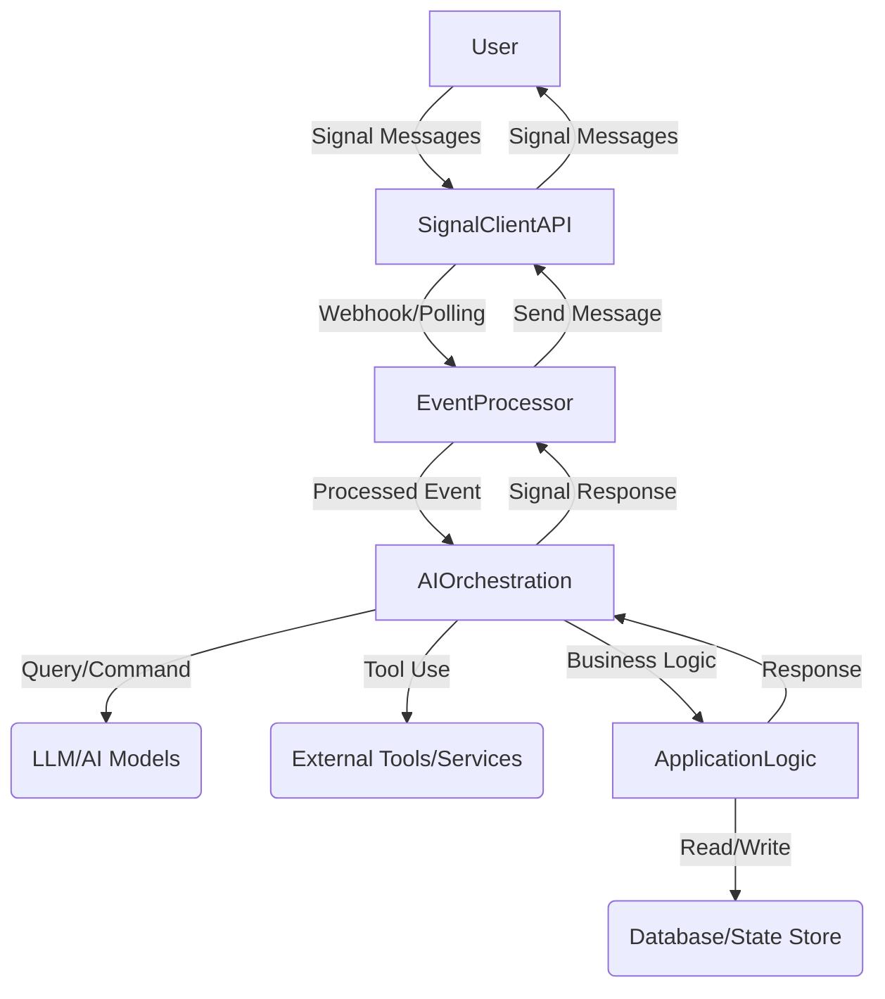

# Design: AI-Powered Signal Assistant Architecture

## 1. Core Principles

*   **Modularity:** Decouple components for easier maintenance, testing, and extensibility.
*   **Scalability:** Design for horizontal scaling to handle increased user load.
*   **Reliability:** Implement robust error handling, retry mechanisms, and state management.
*   **Security:** Adhere to Signal's secure communication principles and protect user data.
*   **Observability:** Integrate logging, monitoring, and tracing for operational insight.

## 2. High-Level Architecture

The AI-powered Signal Assistant will follow a layered architecture, comprising:

*   **Signal Client Layer:** Interfacing directly with the `signal-client` library for sending and receiving Signal messages and events.
*   **Event Processing Layer:** Handling incoming Signal events, routing them to appropriate handlers.
*   **AI Orchestration Layer:** Managing the interaction with various AI models and tools (e.g., LLMs, RAG systems).
*   **Application Logic Layer:** Containing the core business logic, user state management, and task automation.
*   **Persistence Layer:** Storing user data, conversation history, and bot configuration.



## 3. Component Breakdown

### 3.1. Signal Client Layer

*   **`signal-client` Integration:** The core interface to the Signal messaging platform. This project will serve as a thin wrapper around the `signal-client` library, focusing on event handling and message dispatch.
*   **Message Parsers/Serializers:** Convert raw Signal messages into internal domain objects and vice-versa.

### 3.2. Event Processing Layer

*   **Webhook/Polling Listener:** Depending on `signal-client` capabilities, either listens for incoming webhooks or continuously polls the Signal API for new events.
*   **Event Router:** Dispatches different types of Signal events (e.g., new message, group update, reaction) to specific handlers.
*   **Middleware:** Implement pre-processing (e.g., authentication, rate limiting) and post-processing (e.g., logging) of events.

### 3.3. AI Orchestration Layer

This layer will be central to the "AI-powered" aspect, potentially leveraging frameworks like `instructor` (already present in `pyproject.toml`) or `LangChain`/`LlamaIndex`.

### 3.3.1. Context and Memory Management for Virtual Assistant Role

To mimic a real human virtual assistant and overcome inherent LLM limitations with context and memory, the AI Orchestration Layer will implement a multi-faceted memory management strategy:

1.  **Short-Term Conversational Memory (In-Context Learning):**
    *   **Mechanism:** Manage the LLM's context window effectively to retain recent conversational turns. This will be achieved through:
        *   **Sliding Window:** Including the most recent 'N' messages (user and bot) in the prompt.
        *   **Conversation Summarization:** For longer dialogues, condense older turns into concise summaries to preserve key information without exceeding token limits. This will be handled within the attested Privacy Core if possible, or by a specialized component.
        *   **Prompt Compression Techniques:** Utilize methods to reduce the token count of the prompt while retaining semantic meaning.
    *   **Goal:** Maintain coherence and allow the LLM to refer to immediately preceding interactions.

2.  **Long-Term Memory (Knowledge Base & Personalization):**
    *   **Mechanism:** Leverage the Persistence Layer (3.5) to store and retrieve relevant long-term information. This includes:
        *   **User Profiles/Preferences:** Store explicit user settings, preferences, and facts the user has asked the bot to remember (e.g., "My favorite color is blue," "Remind me about X on Y date"). This data will be securely stored and linked only to the user's Signal ID (or an anonymized internal ID).
        *   **Historical Interactions/Summaries:** Store condensed summaries of past conversations, specific resolutions, or key facts extracted from past interactions.
        *   **RAG (Retrieval-Augmented Generation):** Implement a robust RAG system where incoming user queries trigger a retrieval process against this long-term memory store. Relevant documents/facts are then injected into the LLM prompt.
    *   **Goal:** Enable personalization, recall facts from past sessions, and provide contextually rich responses beyond the current conversation window.

3.  **Proactive Context Retrieval & Dynamic Prompting:**
    *   **Mechanism:** The AI Orchestration Layer will analyze incoming messages for keywords or topics that might require information from the long-term memory. It will then proactively retrieve this information and construct dynamic prompts that provide the LLM with the most relevant context.
    *   **Goal:** Provide a seamless, "aware" assistant experience where the bot anticipates needs or recalls relevant information without explicit user prompting.

4.  **Integration with Application Logic (3.4):**
    *   **Mechanism:** Specific bot commands (e.g., `/remember "fact"`, `/forget "fact"`, `/mypatterns`) will allow users to directly manage their long-term memory with the bot. The Application Logic Layer will interface with the AI Orchestration Layer for storage and retrieval.
    *   **Goal:** Give users users control over their personalized memory and foster trust.

This comprehensive approach ensures the bot can maintain a coherent conversation flow, recall past information, and provide personalized responses, effectively mimicking a human virtual assistant within the constraints of LLM technology.

*   **Language Model (LLM) Integration:** Interface with various LLMs (e.g., cloud-based APIs).
*   **Retrieval Augmented Generation (RAG):** Integrate with a knowledge base or search engine for factual recall and contextual responses.
*   **Tooling/Function Calling:** Enable the LLM to call external tools or internal functions (e.g., search, API calls, task management) to fulfill user requests.
*   **Conversation State Management:** Maintain conversation history and context for coherent multi-turn interactions.

### 3.4. Application Logic Layer

*   **Bot Commands/Skills:** Implement specific functionalities and "skills" of the bot. This is where the `src/signal_ai/commands` structure might be re-purposed.
*   **User Management:** Handle user preferences, permissions, and potentially subscription data.
*   **Business Rules:** Enforce commercial aspects and custom logic.

### 3.5. Persistence Layer

*   **Database:** (e.g., SQLite for simplicity, PostgreSQL for scalability) to store:
    *   User profiles and settings.
    *   Conversation history (for context and analysis).
    *   Bot configuration.
    *   Task-related data (reminders, lists, etc.).
*   **Caching:** (e.g., Redis) for frequently accessed data or session state to improve performance.

## 4. Privacy and Technical Inability for Developer Access

A core architectural constraint is ensuring the developer is *technically unable* to access plaintext Signal messages or the bot's private keys. This is achieved through the use of **Confidential Computing / Trusted Execution Environments (TEEs)** for privacy-sensitive components (message decryption, key handling, and critical AI processing).

The `Signal Client Layer` (3.1) and critical parts of the `AI Orchestration Layer` (3.3) must execute within an attested TEE. **Remote Attestation** will be implemented to allow users to cryptographically verify the integrity and behavior of this privacy-preserving code.

For a detailed breakdown of the privacy architecture, security audits, and trust reinforcement, refer to `privacy_design.md`.

## 5. Technology Stack (Proposed/Confirmed)

*   **Python:** Primary language.
*   **`signal-client`:** Core Signal interaction library.
*   **`FastAPI` + `Uvicorn`:** For webhooks and potential internal APIs.
*   **`Poetry`:** Dependency management.
*   **AI Libraries:** `instructor` (for structured output from LLMs).
*   **Database:** Initial recommendation is SQLite for simplicity, with an option to migrate to PostgreSQL for scalability.
*   **Environment Variables:** `python-dotenv` for configuration.

## 6. Utilizing `signal-client` to its Maximum

The design will aim to expose and utilize features such as:

*   **Group Management:** Creating, joining, leaving groups; managing members.
*   **Message Types:** Handling text, media (images, videos, files), stickers, reactions, quotes, mentions.
*   **Security Features:** Leveraging end-to-end encryption if `signal-client` provides direct access or ensuring data handling aligns with Signal's privacy.
*   **Advanced Messaging:** Read receipts, typing indicators (if exposed).

## 7. Project Structure

The project structure will be refined to reflect the new layered architecture. A potential structure could be:

```
src/
├───signal_ai/
│   ├───__init__.py
│   ├───main.py          # Entry point for the bot application
│   ├───config.py        # Configuration management
│   ├───cli.py           # CLI for bot management (start, stop, deploy, etc.)
│   ├───core/
│   │   ├───bot.py       # Main bot orchestration logic
│   │   ├───event_handler.py # Dispatches Signal events
│   │   └───llm_manager.py # Manages LLM interactions
│   ├───signal_adapter/  # Interface with signal-client
│   │   ├───client.py    # Wrapper around signal-client
│   │   ├───events.py    # Event definitions
│   │   ├───messages.py  # Message utilities
│   ├───ai/
│   │   ├───models.py    # Pydantic models for structured AI output
│   │   ├───tools.py     # Definitions for AI-callable tools
│   │   └───orchestrator.py # AI interaction flow
│   ├───services/        # Business logic services (e.g., user management, task management)
│   │   ├───user_service.py
│   │   └───task_service.py
│   ├───persistence/     # Database models and access layer
│   │   ├───database.py
│   │   └───models.py
│   ├───commands/        # Legacy/refactored bot commands (if any are kept/re-purposed)
│   ├───middlewares/     # Event processing middlewares
│   └───utils/           # General utilities
└───tests/
    └───unit/
    └───integration/
```