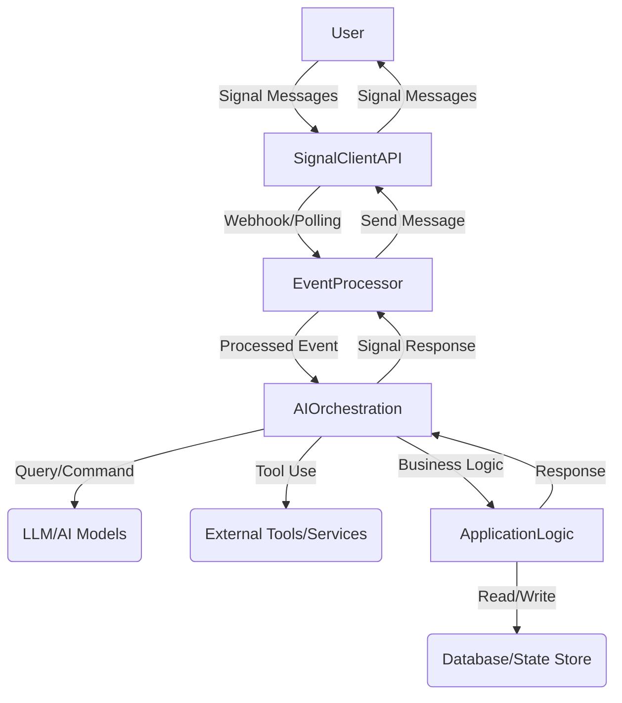

# Design: AI-Powered Signal Assistant Architecture

## 1. Core Principles

*   **Modularity:** Decouple components for easier maintenance, testing, and extensibility.
*   **Scalability:** Design for horizontal scaling to handle increased user load.
*   **Reliability:** Implement robust error handling, retry mechanisms, and state management.
*   **Security:** Adhere to Signal's secure communication principles and protect user data.
*   **Observability:** Integrate logging, monitoring, and tracing for operational insight.

## 2. High-Level Architecture

The AI-powered Signal Assistant will follow a layered architecture, comprising:

*   **Signal Client Layer:** Interfacing directly with the `signal-client` library for sending and receiving Signal messages and events.
*   **Event Processing Layer:** Handling incoming Signal events, routing them to appropriate handlers.
*   **AI Orchestration Layer:** Managing the interaction with various AI models and tools (e.g., LLMs, RAG systems).
*   **Application Logic Layer:** Containing the core business logic, user state management, and task automation.
*   **Persistence Layer:** Storing user data, conversation history, and bot configuration.



## 3. Component Breakdown

### 3.1. Signal Client Layer

*   **`signal-client` Integration:** The core interface to the Signal messaging platform. This project will serve as a thin wrapper around the `signal-client` library, focusing on event handling and message dispatch.
*   **Message Parsers/Serializers:** Convert raw Signal messages into internal domain objects and vice-versa.

### 3.2. Event Processing Layer

*   **Webhook/Polling Listener:** Depending on `signal-client` capabilities, either listens for incoming webhooks or continuously polls the Signal API for new events.
*   **Event Router:** Dispatches different types of Signal events (e.g., new message, group update, reaction) to specific handlers.
*   **Middleware:** Implement pre-processing (e.g., authentication, rate limiting) and post-processing (e.g., logging) of events.

### 3.3. AI Orchestration Layer

This layer will be central to the "AI-powered" aspect, potentially leveraging frameworks like `instructor` (already present in `pyproject.toml`) or `LangChain`/`LlamaIndex`.

### 3.3.1. Context and Memory Management for Virtual Assistant Role

To mimic a real human virtual assistant and overcome inherent LLM limitations with context and memory, the AI Orchestration Layer will implement a multi-faceted memory management strategy:

1.  **Short-Term Conversational Memory (In-Context Learning):**
    *   **Mechanism:** Manage the LLM's context window effectively to retain recent conversational turns. This will be achieved through:
        *   **Sliding Window:** Including the most recent 'N' messages (user and bot) in the prompt.
        *   **Conversation Summarization:** For longer dialogues, condense older turns into concise summaries to preserve key information without exceeding token limits. This will be handled within the attested Privacy Core if possible, or by a specialized component.
        *   **Prompt Compression Techniques:** Utilize methods to reduce the token count of the prompt while retaining semantic meaning.
    *   **Goal:** Maintain coherence and allow the LLM to refer to immediately preceding interactions.

2.  **Long-Term Memory (Knowledge Base & Personalization):**
    *   **Mechanism:** Leverage the Persistence Layer (3.5) to store and retrieve relevant long-term information. This includes:
        *   **User Profiles/Preferences:** Store explicit user settings, preferences, and facts the user has asked the bot to remember (e.g., "My favorite color is blue," "Remind me about X on Y date"). This data will be securely stored and linked only to the user's Signal ID (or an anonymized internal ID).
        *   **Historical Interactions/Summaries:** Store condensed summaries of past conversations, specific resolutions, or key facts extracted from past interactions.
        *   **RAG (Retrieval-Augmented Generation):** Implement a robust RAG system where incoming user queries trigger a retrieval process against this long-term memory store. Relevant documents/facts are then injected into the LLM prompt.
    *   **Goal:** Enable personalization, recall facts from past sessions, and provide contextually rich responses beyond the current conversation window.

3.  **Proactive Context Retrieval & Dynamic Prompting:**
    *   **Mechanism:** The AI Orchestration Layer will analyze incoming messages for keywords or topics that might require information from the long-term memory. It will then proactively retrieve this information and construct dynamic prompts that provide the LLM with the most relevant context.
    *   **Goal:** Provide a seamless, "aware" assistant experience where the bot anticipates needs or recalls relevant information without explicit user prompting.

4.  **Integration with Application Logic (3.4):**
    *   **Mechanism:** Specific bot commands (e.g., `/remember "fact"`, `/forget "fact"`, `/mypatterns`) will allow users to directly manage their long-term memory with the bot. The Application Logic Layer will interface with the AI Orchestration Layer for storage and retrieval.
    *   **Goal:** Give users control over their personalized memory and foster trust.

This comprehensive approach ensures the bot can maintain a coherent conversation flow, recall past information, and provide personalized responses, effectively mimicking a human virtual assistant within the constraints of LLM technology.

*   **Language Model (LLM) Integration:** Interface with various LLMs (e.g., `llama-cpp-python` for local models, or cloud-based APIs).
*   **Retrieval Augmented Generation (RAG):** Integrate with a knowledge base or search engine for factual recall and contextual responses.
*   **Tooling/Function Calling:** Enable the LLM to call external tools or internal functions (e.g., search, API calls, task management) to fulfill user requests.
*   **Conversation State Management:** Maintain conversation history and context for coherent multi-turn interactions.

### 3.4. Application Logic Layer

*   **Bot Commands/Skills:** Implement specific functionalities and "skills" of the bot. This is where the `src/signal_ai/commands` structure might be re-purposed.
*   **User Management:** Handle user preferences, permissions, and potentially subscription data.
*   **Business Rules:** Enforce commercial aspects and custom logic.

### 3.5. Persistence Layer

*   **Database:** (e.g., SQLite for simplicity, PostgreSQL for scalability) to store:
    *   User profiles and settings.
    *   Conversation history (for context and analysis).
    *   Bot configuration.
    *   Task-related data (reminders, lists, etc.).
*   **Caching:** (e.g., Redis) for frequently accessed data or session state to improve performance.

## 4. Achieving Technical Inability for Developer Access (KISS Approach for Privacy)

The core requirement is for the developer (owner) to be *technically unable* to read/see messages or provide them to any authority. This is a higher bar than a policy-based "no-logging" commitment and necessitates a fundamental shift in how the bot is architected and deployed.

### 4.1. The Fundamental Challenge: Decryption Point

Signal's E2EE means messages are decrypted *by the recipient*. For the AI bot to process messages, it *must* decrypt them. The crucial question becomes: **Who controls the environment where the decryption occurs, and where the bot's private keys reside?**

If the developer controls the server that performs decryption, the developer technically can access plaintext messages and private keys. To achieve technical inability for the developer, the decryption point and key custody must be outside the developer's direct, unaudited control.

### 4.2. KISS Approaches for Technical Inability

Considering "KISS" from the perspective of *preventing developer access*, here are the primary technical models:

#### Option A: Client-Side Bot (User-Managed Deployment) - *Simplest for Technical Developer Inability*

*   **Mechanism:** The bot software is distributed to end-users, who then run it on *their own devices*. The Signal private key for the bot (if dedicated, or the user's own key if integrated with their client) is generated and stored locally on the user's device. Messages are decrypted and processed with local AI models (or AI API keys provided by the user) directly on the user's device.
*   **Developer Access:** The developer provides the software but *never hosts or operates the decryption environment*. This ensures the developer is *technically unable* to access messages or private keys.
*   **KISS for Developer Privacy:** This is the most straightforward way to guarantee technical inability for the developer because the developer never touches the plaintext.
*   **Trade-offs:**
    *   **Commercial Model Shift:** This changes the "commercial bot" from a hosted service to distributed software. Monetization would be via software licenses, premium features in the local application, or indirect means.
    *   **User Burden:** Users are responsible for installation, running the software, and potentially managing local AI models or API keys.
    *   **Scalability/Features:** Centralized features (like shared knowledge bases or complex orchestrations across users) become harder or impossible.

#### Option B: Confidential Computing / Trusted Execution Environments (TEEs) - *Achieving Technical Inability in a Hosted Model*

*   **Mechanism:** The bot is deployed as a hosted service, but its core privacy-sensitive components (message decryption, private key handling, and critical AI processing) run within a hardware-backed Secure Enclave (e.g., Intel SGX, AWS Nitro Enclaves).
    *   The bot's Signal private key is provisioned directly into the TEE, cryptographically sealed and accessible *only* by the attested code within the enclave. The developer cannot extract it.
    *   Messages are decrypted within the TEE. The plaintext message content is processed by AI models *within or directly managed by the TEE*.
    *   Remote Attestation allows end-users (or a trusted third-party auditor) to cryptographically verify that the *exact, untampered code* is running inside the TEE and that this code adheres to the no-logging guarantees.

#### 4.2.3. Trustless User Verification via Remote Attestation

To achieve verifiable privacy for users ("trustless" verification), Remote Attestation is the cornerstone mechanism:

*   **Mechanism:** The bot will provide an interface (e.g., a specific Signal command, or a public web endpoint) through which users can request an attestation report from the TEE. This report is a cryptographically signed document from the TEE hardware, containing:
    *   **Code Measurement:** A cryptographic hash (e.g., SHA-256) of the *exact code* loaded and running within the TEE.
    *   **TEE Identity:** Information about the underlying secure hardware (e.g., Intel SGX enclave ID, AWS Nitro Enclave properties).
    *   **Hardware Signature:** The entire report is signed by a hardware-rooted key, providing tamper-proof evidence.
*   **User Verification Process:**
    1.  The user (or their client-side tool) obtains the attestation report from the bot.
    2.  The user verifies the report's signature against public keys provided by the TEE hardware vendor, confirming its authenticity.
    3.  The user compares the *code measurement hash* from the report against a **publicly published hash** of the bot's privacy-preserving, compiled TEE code. This published hash will represent the exact code that promises no message logging and secure key handling.
    4.  If the signature is valid and the hashes match, the user has cryptographic proof that the claimed privacy-preserving code is indeed running in an untampered secure environment.
*   **Communication to User:**
    *   **Public Hash Publication:** The developer will publicly publish the cryptographic hash(es) of the attested TEE code (e.g., on a dedicated website, in the bot's documentation).
    *   **In-Bot Commands:** Provide clear, user-friendly Signal commands (e.g., `/attest`) for users to request and view their bot's attestation report.
    *   **User-Friendly Tools/Documentation:** Offer or recommend client-side tools and provide comprehensive documentation explaining how users can perform the attestation verification themselves, including links to TEE vendor resources for public key verification.
    *   **Transparency:** Clearly explain the limitations and the scope of what attestation proves (code integrity and secure environment), and what it does not (e.g., the specific LLM used for inference, if that LLM runs outside the TEE boundary).

*   **Developer Access:** The developer controls the deployment of the code, but the underlying cloud provider (and the developer) is *technically unable* to inspect the memory, logs, or disk within the TEE to access plaintext messages or private keys. Any attempt by the host to tamper would invalidate attestation.
*   **KISS for Developer Privacy (Hosted):** This is the "KISS" path to achieve *technical inability* for developer access while still operating a hosted, commercial service. It requires trust in the hardware vendor and the TEE's security model.
*   **Trade-offs:**
    *   **Implementation Complexity:** While "KISS" for the *outcome* of developer non-access in a hosted model, implementing and managing TEEs adds significant architectural and operational complexity. Code needs to be designed for the enclave environment, and attestation mechanisms must be robust.
    *   **Cost:** TEE environments can be more expensive to operate.
    *   **LLM Integration:** Running large LLMs entirely within a TEE might still be challenging due to memory and performance constraints, potentially requiring careful design to ensure the entire sensitive AI processing pipeline remains protected.

### 4.3. Recommendation for Initial Phase (Hosted Commercial Bot)

Given the explicit requirement for a **hosted, commercial, closed-source bot**, Option A (Client-Side Bot) is not viable as it fundamentally alters the commercial model.

Therefore, to achieve the goal of the developer being *technically unable to read/see messages* while operating a hosted service, **Confidential Computing / Trusted Execution Environments (Option B)** is the **required architectural direction** for privacy-sensitive components.

This implies:
*   The Signal private key for the bot must be provisioned directly into a TEE, inaccessible to the host operator.
*   The `3.1. Signal Client Layer` (specifically message decryption) and critical parts of the `3.3. AI Orchestration Layer` (where message content is processed by AI) must be designed to execute within this attested TEE.
*   **Remote Attestation (as detailed in 4.2.3) will be implemented** to enable users to cryptographically verify the integrity and expected behavior of the bot's privacy-sensitive code.
*   While increasing implementation complexity, this is the "KISS" solution for the specific constraint of *developer technical inability* in a hosted, commercial context.
*   A strong no-logging policy for content will also be enforced, complementing the technical safeguards of the TEE.

## 4.4. Security Audit and Trust Reinforcement

As a security researcher auditing the proposed Confidential Computing (TEEs + Remote Attestation) model for a hosted, commercial, closed-source bot, the following potential flaws and risks are identified, along with proposed countermeasures to ensure users are not at risk or are immediately aware of compromise.

### 4.4.1. Identified Vulnerabilities and Limitations

1.  **Trust in TEE Hardware/Vendor:**
    *   **Flaw:** The entire security model hinges on the trustworthiness and integrity of the TEE hardware vendor (e.g., Intel, AWS). Undiscovered hardware bugs, microcode vulnerabilities, or covert backdoors could compromise the TEE's guarantees.
    *   **Countermeasure (Partial):** Rely on industry-wide vetting of TEE providers and their track record. No direct technical countermeasure from the bot developer beyond choosing reputable vendors.

2.  **Attestation Gap & Dynamic Code Loading:**
    *   **Flaw:** While TEEs attest to the initial boot and application code, vulnerabilities could exist in the minimal OS/runtime within the TEE if not fully measured. More critically, if the bot dynamically loads code, plugins, or *new LLM weights/models* *after* initial attestation, these changes would not be covered by the initial measurement. An attacker (or compromised developer) could inject malicious dynamic content.
    *   **Countermeasure:** Strict control over all code and data loaded into the TEE. Implement a mechanism to ensure *all* relevant executable code and critical configuration (including LLM model hashes if loaded dynamically from a trusted source) are part of the attested measurement. If dynamic loading is essential, ensure secondary attestation or cryptographic verification of loaded modules.

3.  **LLM Inference Boundary (External API Usage & Data Exposure):
    *   **Flaw:** It is confirmed that the bot will *always* use external LLM APIs (e.g., ChatGPT, Gemini). This means the plaintext prompt (derived from the decrypted Signal message) *will* be sent *outside* the TEE for inference. This exposes the sensitive message content to the external LLM service provider. While individual Signal users are anonymous to the LLM provider (as requests are made via the bot's API key, not individual user accounts), the *bot operator's API key* and all associated prompt content are visible to the LLM service provider.
    *   **Countermeasure:**
        *   **Strict De-identification by Privacy Core:** The open-source Privacy Core (within the TEE) *must* be rigorously designed and audited to strip all personally identifiable information (PII) from the prompt before sending it to the external LLM API. Only the raw, anonymized message content and necessary contextual information (e.g., conversation summary, retrieved facts) should be passed.
        *   **Transparent Communication:** Clearly communicate this trust boundary to users via the privacy policy. Explicitly state that while their identity is shielded from the LLM provider, the content of their messages (anonymized) is sent to a third-party LLM service.
        *   **LLM Provider Choice:** Select LLM providers with strong privacy policies, robust security, and options for zero data retention for API usage.
        *   **No PII in External Logs:** The Privacy Core ensures no PII is included in the prompt or any metadata sent to the external LLM, mitigating the risk of PII being logged by the LLM provider.

4.  **Signal Private Key Initial Provisioning:**
    *   **Flaw:** The process of initially getting the bot's Signal private key *into* the TEE securely, without the developer ever seeing it in plaintext, is a critical step. If this process is flawed, the key can be compromised from the start.
    *   **Countermeasure:** Implement a robust, multi-party key provisioning ceremony or leverage hardware-backed key generation within the TEE itself, allowing the user (or a trusted third party) to directly provision the key into the attested TEE instance.

### 4.4.2. Developer Compromise & Malicious Updates

This is the most critical scenario for "user not at risk or will be aware."

1.  **Forced Malicious Update:**
    *   **Flaw:** A compromised developer is forced to create and deploy a malicious update (e.g., one that logs messages, or acts erratically) to the TEE.
    *   **Countermeasure (Primary): Automated, Continuous Remote Attestation:**
        *   **User-Side Attestation Agent:** Develop and provide a dedicated, open-source client-side application or browser extension that *continuously* (e.g., every few minutes) requests and verifies the attestation report from the bot's TEE.
        *   **Trusted Hash Whitelist:** This agent maintains a local, user-controlled whitelist of *known-good, publicly verified hashes* for the bot's code. These hashes should ideally be published and signed by an independent third-party auditor.
        *   **Immediate Alerting:** If the attested hash deviates from the whitelist, if attestation fails, or if communication with the attestation service is disrupted, the user's client *must immediately and prominently alert the user* (e.g., "WARNING: Bot's code integrity compromised! Stop using immediately!"), and optionally block further interaction with the bot.
        *   **User Empowerment:** This empowers the user with near real-time awareness of a compromise, fulfilling the "user will be aware" requirement.

2.  **Malicious Code Within Attested Bundle (Closed-Source Problem):**
    *   **Flaw:** A compromised developer *writes* and successfully attests a version of the bot code that *appears* benign but contains subtle backdoors or logging enabled under specific, hard-to-detect conditions. Remote Attestation proves *what code is running*, but not *what the code does* if the user cannot read it.
    *   **Countermeasure (Strongest): Open-Sourcing TEE-Bound Critical Code:**
        *   To fully achieve "trustless" verification of the *content* of the privacy guarantees, the critical code running within the TEE (the Signal client layer, message decryption, and AI prompting/orchestration for content) **must be open-sourced**.
        *   This allows security researchers and the community to audit the exact code whose hash is being attested. This is the only way to verify that the code truly adheres to the no-logging, no-data-exfiltration promises.
        *   The attested hash would then correspond to this publicly auditable codebase.
    *   **Alternative (Weaker): Independent Security Audits:** Regular, public, and transparent security audits by reputable third parties could provide some assurance, but this still relies on trusting the auditor and their findings, rather than direct user verification.

### 4.4.3. Conclusion on Trust Reinforcement

Achieving the user's extreme security goal ("not at risk or aware even if dev is compromised") requires moving beyond simple TEE deployment. The key elements for truly trustless user awareness are:

1.  **Automated, continuous user-side attestation** with a trusted hash whitelist and immediate alerting.
2.  **Open-sourcing the critical, TEE-bound code** that handles sensitive message content and private keys. Without this, users cannot verify the *intent* of the attested code, reintroducing a trust model.

This combination shifts the trust from the developer's promise to cryptographic and community verifiable proof.

### 4.4.4. Additional Measures for Trust and Transparency

1.  **Clear Communication of Trust Boundaries:**
    *   **Recommendation:** User-facing documentation and privacy policies *must* explicitly delineate the trust boundaries. Clearly state what Remote Attestation verifies (the open-source Privacy Core) and what remains subject to developer integrity (the closed-source Core Bot's behavior).
    *   **Impact:** Manages user expectations and clarifies the actual scope of verifiable privacy.
2.  **Regular, Public Security Audits (of both parts):**
    *   **Recommendation:** Beyond open-sourcing, regular, independent security audits of *both* the open-source Privacy Core and the closed-source Core Bot should be conducted and their results published transparently.
    *   **Impact:** Provides additional assurance for the closed-source components and reinforces trust in the open-source parts.

## 4.5. Final Cryptographic and Security Audit (Hybrid Open/Closed Source Model)

This audit builds upon the previous security analysis, focusing specifically on the cryptographic implications and trust model of a system where the "Privacy Core" (TEE-bound, critical code) is open-source and attested, while the broader "Core Bot" (application logic, tools, business features) remains closed-source. The goal is to maximize user safety and awareness, even if the developer is compromised.

### 4.5.1. Cryptographic Guarantees of Remote Attestation (Revisited)

Remote Attestation, when implemented correctly with continuous user-side verification, provides a cryptographic proof that:
1.  **Integrity:** The exact, unmodified *open-source Privacy Core code* (whose hash is publicly known) is running within the TEE.
2.  **Confidentiality:** The Privacy Core's secrets (Signal private key) and its runtime data (decrypted messages, generated prompts) are protected from the developer and the cloud provider *while inside the TEE*.
3.  **Authenticity:** The TEE hardware is genuine and produced by a trusted vendor.

**What Attestation *Does Not* Cryptographically Guarantee in this Hybrid Model:**
*   **Malicious intent of the Closed-Source Core Bot:** It doesn't prove that the closed-source Core Bot will act benignly, or that it won't misuse data *derived from* the Privacy Core.
*   **Privacy of data *after* it leaves the Privacy Core (TEE):** Unless the data is re-encrypted or heavily anonymized *by the Privacy Core* before interacting with the Closed-Source Core Bot or external services.

### 4.5.2. Key Trust Boundaries and Attack Vectors

1.  **Interface Between Privacy Core (Open) and Core Bot (Closed):**
    *   **Description:** This is the most critical trust boundary. The Privacy Core decrypts the message and potentially generates an LLM prompt. The Closed-Source Core Bot handles business logic, tool execution, and constructs the final response.
    *   **Attack Vector:** A compromised developer could modify the Closed-Source Core Bot to:
        *   Request more sensitive data than necessary from the Privacy Core.
        *   Misinterpret or manipulate the Privacy Core's output (e.g., if the Privacy Core returns structured data, the Core Bot could use it maliciously).
        *   Instruct the Privacy Core to send a specific malicious message back to the user.
        *   Log *derived information* from the Privacy Core's output (e.g., log the AI's response, or summary of the conversation, even if the original message isn't logged).
    *   **Mitigation (Cryptographic & Architectural):**
        *   **Minimal, Cryptographically Enforced API:** The API between the Privacy Core and the Closed-Source Core Bot *must be minimal, strict, and cryptographically enforced*. The Privacy Core should only expose functions that return *encrypted* results to the Core Bot, or highly sanitized/anonymized metadata that cannot be re-identified.
        *   **Open-Source API Contract:** The interface specification (API contract) between the Privacy Core and the Core Bot should be open-source. This allows users/auditors to verify that the Privacy Core is *only* exposing minimal, necessary, and safely processed information.
        *   **Privacy Core as Data Firewall:** The Privacy Core should act as a strict firewall, filtering and sanitizing all requests from the Closed-Source Core Bot, and ensuring any data exiting it is protected according to policy.

2.  **LLM Integration (Prompt and Response Fidelity):**
    *   **Description:** The Privacy Core generates the prompt for the LLM. The LLM then generates a response. This response is fed back to the bot (either directly to the Privacy Core or to the Closed-Source Core Bot for final formatting).
    *   **Attack Vector:**
        *   **Prompt Leakage (if LLM is external to TEE):** If the prompt leaves the attested Privacy Core for an external LLM, that's a trust leak.
        *   **Malicious LLM Response:** A compromised developer could use a malicious LLM model (either local but outside the TEE, or a compromised external service) to generate misleading or harmful responses.
    *   **Mitigation (Cryptographic & Architectural):**
        *   **LLM within TEE:** Strongly prioritize running the LLM entirely within the attested Privacy Core. This encrypts the LLM model and its execution.
        *   **Cryptographic Verification of LLM:** If an external LLM is used, the Privacy Core should cryptographically verify the LLM's identity/authenticity where possible.
        *   **Output Validation:** The Privacy Core should implement strict validation and sanitization of LLM outputs before they are processed by the Closed-Source Core Bot or sent to the user, to prevent injection attacks or harmful content.

3.  **Key Management Lifecycle:**
    *   **Description:** Beyond initial provisioning, the Signal private key within the TEE has a lifecycle (rotation, revocation, backup).
    *   **Attack Vector:** Flaws in key rotation or backup could expose the key.
    *   **Mitigation:** The key management logic within the open-source Privacy Core must be robust, auditable, and adhere to best practices for HSM-like operations. Users should have a mechanism to trigger key rotation or complete revocation of the bot's access via Signal mechanisms.

4.  **User Experience for Trust and Awareness:**
    *   **Description:** For all these technical safeguards to be effective, users *must* understand and utilize them.
    *   **Attack Vector:** User apathy or misunderstanding defeats the purpose.
    *   **Mitigation:**
        *   **Simplified Attestation Tools:** Provide extremely user-friendly tools (e.g., a simple one-click Signal bot that guides the user through verification, or a desktop app) for attestation.
        *   **Educational Materials:** Comprehensive, easy-to-understand documentation and tutorials on the attestation process, what it proves, and the remaining trust boundaries.
        *   **Emergency Kill Switch:** Provide a clear, accessible way for users to "kill" their interaction with the bot or revoke its Signal access if they detect a compromise or lose trust.

### 4.5.3. Conclusion on Hybrid Model Security

While the hybrid model significantly enhances trust by open-sourcing and attesting the privacy-critical components, it introduces new interface-based trust boundaries. To truly deliver on the promise of user safety and awareness even under developer compromise, the following are paramount:

1.  **Rigorous Design of the Privacy Core <-> Core Bot Interface:** This interface must be minimal, cryptographically secure, and its contract openly specified.
2.  **Strong Emphasis on In-TEE LLM Inference:** To protect prompts and responses end-to-end within the attested boundary.
3.  **Continuous User Education and Accessible Tools:** Empowering users to actively verify and act upon security alerts.

This combination of open-source transparency for the critical path, robust cryptographic enforcement, and user empowerment is essential for achieving the user's extreme security and trust goals.

## 5. Technology Stack (Proposed/Confirmed)

*   **Python:** Primary language.
*   **`signal-client`:** Core Signal interaction library.
*   **`FastAPI` + `Uvicorn`:** For webhooks and potential internal APIs.
*   **`Poetry`:** Dependency management.
*   **AI Libraries:** `llama-cpp-python` (for local LLMs), `instructor` (for structured output from LLMs).
*   **Database:** Initial recommendation is SQLite for ease of development, with an option to migrate to PostgreSQL for production.
*   **Environment Variables:** `python-dotenv` for configuration.

## 6. Utilizing `signal-client` to its Maximum

The design will aim to expose and utilize features such as:

*   **Group Management:** Creating, joining, leaving groups; managing members.
*   **Message Types:** Handling text, media (images, videos, files), stickers, reactions, quotes, mentions.
*   **Security Features:** Leveraging end-to-end encryption if `signal-client` provides direct access or ensuring data handling aligns with Signal's privacy.
*   **Advanced Messaging:** Read receipts, typing indicators (if exposed).

## 7. Project Structure

The project structure will be refined to reflect the new layered architecture. A potential structure could be:

```
src/
├───signal_ai/
│   ├───__init__.py
│   ├───main.py          # Entry point for the bot application
│   ├───config.py        # Configuration management
│   ├───cli.py           # CLI for bot management (start, stop, deploy, etc.)
│   ├───core/
│   │   ├───bot.py       # Main bot orchestration logic
│   │   ├───event_handler.py # Dispatches Signal events
│   │   └───llm_manager.py # Manages LLM interactions
│   ├───signal_adapter/  # Interface with signal-client
│   │   ├───client.py    # Wrapper around signal-client
│   │   ├───events.py    # Event definitions
│   │   └───messages.py  # Message utilities
│   ├───ai/
│   │   ├───models.py    # Pydantic models for structured AI output
│   │   ├───tools.py     # Definitions for AI-callable tools
│   │   └───orchestrator.py # AI interaction flow
│   ├───services/        # Business logic services (e.g., user management, task management)
│   │   ├───user_service.py
│   │   └───task_service.py
│   ├───persistence/     # Database models and access layer
│   │   ├───database.py
│   │   └───models.py
│   ├───commands/        # Legacy/refactored bot commands (if any are kept/re-purposed)
│   ├───middlewares/     # Event processing middlewares
│   └───utils/           # General utilities
└───tests/
    └───unit/
    └───integration/
```

This structure aims to clearly separate concerns and facilitate independent development and testing of each layer.